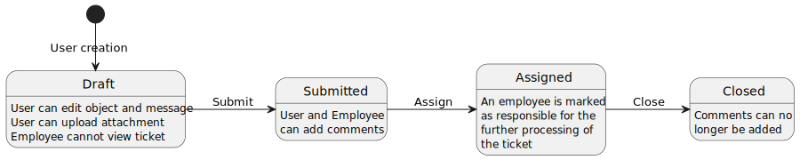
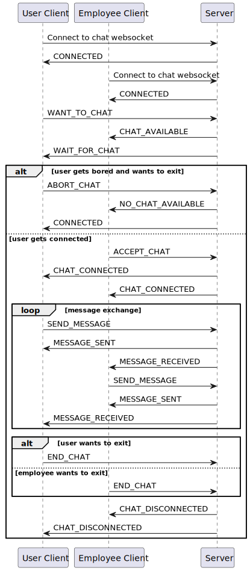

# Documentazione software

__Nome__: Simone Basile
__Matricola__: 913859
__Codice persona__: 10671975

## Scopo del progetto e premesse

Lo scopo del progetto è la realizzazione di un webserver da zero, in grado di supportare lo sviluppo di applicazioni web, interamente utilizzando `java SE 17`.

Il progetto comprende sia il webserver sia un'applicazione web, costruita allo scopo di dimostrare le funzionalità e l'utilizzabilità del webserver.

Il software allegato è quindi composto da due moduli, un modulo `WebServer` contenente la libreria, e un modulo `SampleApp` che contiene l'applicazione di esempio.

Per lo sviluppo del progetto si è cercato di ridurre al minimo le librerie utilizzate e di sviluppare da zero le funzionalità necessarie al funzionamento dell'applicativo per avere modo di familiarizzare, in modo il più possibile approfondito, con le tecnologie e i protocolli su cui si basano moltissime delle applicazioni che si utilizzano ogni giorno.

## Modulo WebServer

Il modulo `WebServer` è una libreria che permette la creazione di un webserver java

### Dipendenze

Il modulo utilizza `java 17` e utilizza solo una libreria di logging.

La libreria utilizzata è `Simple Logging Facade for Java` o `slf4j` che fornisce un'interfaccia per il logging unica, e permette di utilizzare diverse libreria di logging come backend, permettendo agli utilizzatori della libreria di scegliere la libreria di logging che preferiscono.

### Struttura

Il diagramma di seguito descrive la divisione in package del webserver e una breve descrizione del contenuto di ogni package


La gestione dei package esposti dal modulo WebServer è effettuata tramite module system di java, introdotto con `java 9`.
La lista dei package esposti è controllata dal file `module-info.java`.
Tutti i package descritti sono esposti, ad esclusione del package `internals`.

### Componenti principali

Di seguito sono elencate le classi principali necessarie all'utilizzo del webserver.

#### WebServer

La classe `WebServer` è la classe principale del webserver, contiene la logica per accettare e gestire le connessioni html e websocket. Attraverso il webserver è possibile registrare degli handler per gestire le richieste http e websocket e aggiungere degli interceptor che vengono eseuti prima di passare la richiesta all'handler.

I metodi principali sono:
- `void start()` avvia il server
- `void stop()` ferma il server
- `void registerHttpContext(String path, HttpRequestHandler<Body, ? super Context> handler)` registra un handler http associato ad un path e ai subpath
- `void registerHttpHandler(String path, HttpRequestHandler<Body, ? super Context> handler)` registra un handler http associato ad un path specifico
- `void registerInterceptor(HttpInterceptor<Body, Context> interceptor)` registra un interceptor che intercetta le richieste
- `void registerWebSocketContext(String path, WebsocketHandler<?, ? super Context> handler)` registra un handler websocket associato ad un path e ai subpath
- `void registerWebSocketHandler(String path, WebsocketHandler<?, ? super Context> handler)` registra un handler websocket associato ad un path specifico
  
Si instanzia tramite il builder `WebServerBuilder` che permette di configurarne il funzionamento.

#### HttpRequestHandler

L'interfaccia `HttpRequestHandler` è l'interfaccia principale per la gestione delle richieste http.
Tutte le classi che gestiscono le richieste http implementano questa interfaccia.

L'interfaccia ha un solo metodo da implementare: `HttpResponse<? extends HttpResponseBody> handle(HttpRequest<? extends Body> r, Context requestContext)` che riceve come argomenti la request http e il RequestContext del webserver, e restituisce la response http 

#### HttpRequest

La classe `HttpRequest` contiene i dati della richiesta http ricevuta dal server. 
Contiene:
- Metodo http
- Path http
- Versione protocollo http
- Headers
- Eventuale Body

#### HttpResponse

La classe `HttpRequest` contiene i dati della richiesta http ricevuta dal server. 
Contiene:
- Status Code http
- Versione protocollo http
- Headers
- Eventuale Body

#### HttpResponseBody

L'interfaccia `HttpResponseBody` contiene i metodi necessari alla serializzazione del body di una response http.

L'interfaccia ha 3 metodi da implementare: 

- `void write(OutputStream out) throws IOException`: questo metodo prende come argomento un OutputStream su cui scrivere il body della response
- `Long contentLength()`: questo metodo ritorna la lunghezza del body da scrivere nella response o null se la lunghezza non è conosciuta a priori. Se si è specificata una lunghezza, il numero di byte scritti dal metodo `write` deve coincidere con quanto specificato. Se non si è specificata una lunghezza la response verrà inviata con `Transfer-Encoding: chunked`
- `String contentType()`: questo metodo deve ritornare il `content-type` associato alla response.


#### HttpInterceptor

L'interfaccia `HttpInterceptor` è l'interfaccia da implementare per intercettare richieste http.

L'interfaccia permette di preprocessare le request, modificare le response, o fermare una richiesta non valida rispondendo al posto dell'handler.

L'interfaccia ha un solo metodo da implementare `HttpResponse<? extends HttpResponseBody> intercept(HttpRequest<? extends Body> request, Context requestContext, HttpRequestHandler<Body, Context> next)` che prende come argomenti la richiesta http ricevuta, il requestContext http e l'handler che dovrebbe gestire la risposta

#### WebsocketHandler

L'interfaccia `WebsocketHandler` permette di gestire gli eventi legati alle connessioni che usano il protocollo websocket.

L'interfaccia prevede 5 metodi da implementare:

- `WebsocketContext newContext(HttpRequestContext ctx)`: questo metodo viene invocato appena si riceve una richiesta di connessione websocket. Questo metodo serve a creare il context che conterrà lo stato relativo alla connessione websocket corrente, che verrà passato a tutte le chiamate websocket della stessa connessione
- `HandshakeResult onServiceHandshake(String[] availableProtocols, WebsocketContext context)`: questo metodo viene invocato successivamente al metodo newContext, riceve come parametri il context creato e un array di sottoprotocolli websocket richiesti dal client. Questo metodo deve ritornare un `HandshakeResult` che può essere costruito con `HandshakeResult.accept(String protocol)` passando il protocollo selezionato tra quelli ricevuti se si accetta la richiesta di connessione websocket, o con `HandshakeResult.refuse(String message)` passando un messaggio da inviare al client, se non si accetta la richiesta di connessione.
- `void onHandshakeComplete(WebsocketWriter websocketWriter, WebsocketContext context)`: questo metodo viene chiamato una volta che l'handshake websocket è completato. riceve come parametri il context websocket e un istanza di `WebSocketWriter` che permette di inviare messaggi al client che ha completato l'handshake
- `void onMessage(WebsocketMessage msg, WebsocketContext context)`: questo metodo viene chiamato ogni volta che arriva un messaggio dal client. al metodo vengono passati il context websocket e il messaggio ricevuto.
- `void onClose(WebsocketContext context)`: questo metodo viene chiamato quando il client chiude la connessione websocket. Al metodo viene passato il context websocket

### Esempi di utilizzo

#### registrazione di un semplice handler

```java
WebServer<?> srv = WebServer.builder().build();
srv.registerHttpContext("/", (request, context) -> {
    return new HttpResponse(200, new ByteResponseBody("Hello"));
});
srv.start();
```

Questo esempio mostra la creazione di un server che risponde con stato `200` e `Hello` a tutte le chiamate:

`WebServer srv = Webserver.builder().build()` crea un server con le configurazioni di default.

`srv.registerHttpContext("/", (request, context) => { ... })` registra un handler che viene utilizzato per tutti i sottopath del path indicato.

`new HttpResponse(200, new ByteResponseBody("Hello"))` crea una risposta http che ha nel body la stringa `Hello`. Il `ByteResponseBody`, quando costruito con una stringa come parametro mette la stringa nel body e configura il content type della response come `text/plain`.

#### Servire file statici

```java
WebServer<?> srv = WebServer.builder().build();
srv.registerHttpContext("/resources", 
    new StaticFileHandler<>("/path/to/resources")
);
srv.start();
```

Questo esempio mostra come servire file statici usando la classe `StaticFileHandler`.

```bash
> tree
path
└─ to
   ├─ secret-file
   └─ resources
      ├── index.html
      ├── script.js
      └── style.css
```

Con il codice mostrato e le cartelle qui sopra

- chiamare `http://localhost/resources/index.html` restituisce il file `index.html` con content type `text/html`
- chiamare `http://localhost/resources/script.js` restituisce il file `script.js` con content type `text/javascript`
- chiamare `http://localhost/resources/style.css` restituisce il file `style.css` con content type `text/css`
- chiamare `http://localhost/resources/missing.txt` restituisce un errore `404` dato che il file non esiste
- chiamare `http://localhost/resources/` restituisce il file `index.html` con content type `text/html`, dato che la classe `StaticFileHandler` quando il path punta ad una cartella cerca all'interno un file `index.html` 
- chiamare `http://localhost/resources/../secret-file` restituisce un errore `404` dato che `StaticFileHandler` impedisce di accedere a file quando il percorso contiene delle parti di path con funzioni particolari, come `..` o `~`

#### Registrazione di un interceptor

```java
WebServer<?> srv = WebServer.builder().build();

srv.registerInterceptor((request, context, next) -> {
    request.getHeaders().add("X-Intercepted-At", LocalDateTime.now().toString());
    var response = next.handle(request, context);
    response.getHeaders().add("X-Intercepted", "true");
    return response;
});

srv.registerHttpContext("/", (r, c) -> {
    //Interceptor added data to request
    String interceptedAt = r.getHeaders().getFirst("X-Intercepted-At");
    assert interceptedAt != null; 

    return new HttpResponse<>(200, 
        new ByteResponseBody("Hello at " + interceptedAt));
});

srv.start();
```

Questo esempio estende quello precedente mostrando l'utilizzo di un interceptor aggiungendo un header alla request e che arriva all'handler e un header alla response che viene restituita al client.

#### Specificità degli handler

```java
WebServer<?> srv = WebServer.builder().build();
srv.registerHttpContext("/", (request, context) -> {
    return new HttpResponse<>(200, new ByteResponseBody("Hello"));
});
srv.registerHttpContext("/world", (request, context) -> {
    return new HttpResponse<>(200, new ByteResponseBody("Hello World and more"));
});
srv.registerHttpHandler("/world", (request, context) -> {
    return new HttpResponse<>(200, new ByteResponseBody("Hello World"));
});
srv.start();
```

- Una chiamata a `http://localhost/` risponde con `Hello`
- Una chiamata a `http://localhost/other` risponde con `Hello`
- Una chiamata a `http://localhost/world` risponde con `Hello World`
- Una chiamata a `http://localhost/world/etc` risponde con `Hello World and more`

la prima chiamata ha come path `/` che corrisponde al primo handler e viene quindi gestito dal primo handler

la seconda chiamata ha come path `/other` che non corrisponde esattamente a nessun handler, ma essendo un sottopath di `/` viene gestito dal primo handler

la terza chiamata ha come path `/world` che corrisponde sia al secondo che al terzo handler, ma dato che il terzo handler è più specifico per quel path, è quello a gestire la chiamata

la quarta chiamata ha come path `/world/etc` che non corrisponde a nessun handler, ma è un sottopath sia del primo che del secondo handler. Dato che il secondo handler è più specifico è quello che gestirà la chiamata

#### gestire una connessione websocket

```java
class SimpleContext {
    WebsocketWriter writer;
    String connectionId;
    String protocol;
    /* GETTERS AND SETTERS */
}

class WSHandler implements WebsocketHandler<SimpleContext, RequestContext> {

    public SimpleContext newContext(RequestContext ctx) {
        //Volendo è anche possibile prendere delle informazioni dal
        //request context (ad esempio dati sull'autenticazione)
        //e spostarli nel context della connessione
        var connCtx = new SimpleContext();
        connCtx.connectionId = UUID.randomUUID().toString();
        return connCtx;
    }

    public HandshakeResult onServiceHandshake(String[] availableProtocols, SimpleContext ctx) {
        if (availableProtocols.length == 0) return HandshakeResult.refuse("No protocol");
        else {
            ctx.protocol = availableProtocols[0];
            return HandshakeResult.accept(ctx.protocol);
        }
    }

    public void onHandshakeComplete(WebsocketWriter writer, SimpleContext ctx) {
        //La connessione websocket è completa. Salva il writer per 
        //poter inviare messaggi al client in seguito
        System.out.println("Connected " + ctx.connectionId
                + " using protocol " + ctx.protocol);
        ctx.writer = writer;
    }

    public void onMessage(WebsocketMessage msg, SimpleContext ctx) {
        //Un messaggio websocket puo contenere test o dati binari
        //In questo esempio gestiamo solo i messaggi testuali
        assert msg.type == WebsocketMessage.MsgType.TEXT;
        //I messaggi websocket possono essere divisi in chunk.
        //In questo esempio gestiamo messaggi con un singolo chunk
        assert msg.data.length == 1;
        String message = new String(msg.data[0]);
        System.out.println("Received message from " + ctx.connectionId
                + ": " + message);
        try {
            ctx.writer.sendText("Responding to: " + message);
        } catch (IOException e) {
            System.err.println("An error occurred while writing message");
        }
    }

    public void onClose(SimpleContext ctx) {
        System.out.println("Disconnected: " + ctx.connectionId);
    }
}

WebServer<?> wsSrv = WebServer.builder().build();
wsSrv.registerWebSocketHandler("/", new WSHandler());
        wsSrv.start();
```

Questo è un esempio di gestione di una connessione websocket.

In questo esempio ogni volta che un client invia un messaggio, il server stampa a console il messaggio ricevuto e risponde al client con un acnkowledgment del messaggio ricevuto.

Vengono anche stampati in console informazioni sulle connessioni effettuate e sulle connessioni terminate

### Threading model

Il webserver è basato su un thread principale, che accetta le connessioni, e su una thread pool che esegue i task per gestire le richieste.


Ogni connessione viene gestita da un thread della thread pool, su cui viene eseguito un task che legge le richieste in arrivo sulla connessione e le gestisce tramite gli handler registrati.

Nel caso in cui il server riceva una richiesta di passaggio a websocket, lo stesso thread che si occupava di gestire le richieste http si occupa di gestire i messaggi websocket, chiamando l'handler registrato per i messaggi websocket.

### Design patterns

#### Factory pattern

Il factory pattern permette di creare oggetti senza specificare la classe concreta dell'oggetto che si vuole creare.

È utilizzato in `ServerSocketFactory` e in `RequestContextFactory` per permettere la configurazione del webserver.


In `ServerSocketFactory` è utilizzato per permettere la configurazione del socket che il server utilizza per accettare connessioni, permettendo ad esempio di utilizzare una connessione tls invece di una semplice connessione tcp, o potenzialmente di avere il server in ascolto su un unix socket.


In `RequestContextFactory` è utilizzato per permettere di personalizzare il `RequestContext`, permettendo così ad esempio di aggiungere informazioni aggiuntive che vengono passate agli handler.

Un esempio di utilizzo lo si puù trovare nel modulo `SampleApp` dove viene utilizzato per instanziare la classe `ApplicationRequestContext` che contiene informazioni aggiuntive sull'autenticazione.

#### Strategy pattern

Lo strategy pattern permette di incapsulare comportamenti diversi in classi separate e di utilizzarli intercambiabilmente a runtime


È utilizzato in `RequestHandler` per permettere di registrare diversi handler per gestire le richieste.

#### Decorator pattern

Il decorator pattern permette di aggiungere o modificare le funzionalità di un oggetto senza modificarne la struttura


È utilizzato da `FixedLengthInputStream`, `ChunkedOutputStream`, `UnmaskingInputStream`, `HttpInputStream` e `HttpOutputStream`.

- `FixedLengthInputStream` permette di leggere un numero fisso di byte da un input stream, in questo modo passando l'input stream ad un handler ci si può assicurare che non vengano letti byte appartenenti alla richiesta successiva
- `ChunkedInputStream` permette di scrivere il body di una risposta in chunk, senza conoscerne a priori la lunghezza, come definito per le richieste con `Transfer-Encoding: chunked`
- `UnmaskingInputStream` permette di decodificare i dati ricevuti da un client websocket, facendo il bitwise xor dei dati con la maschera ricevuta
- `HttpInputStream` e `HttpOutputStream` aggiungono metodi di utility utili per leggere request e scrivere response http

#### Builder pattern

Il builder pattern permette di costruire un oggetto complesso passo passo, permettendo di configurare l'oggetto in modo flessibile


È utilizzato per la costruzione del `WebServer` permettendo di configurare il socket e la creazione del contesto delle richieste

### Testing

Per testare dell'applicativo sono stati effettuati dei test unitari con junit delle classi che compongono l'applicativo.

Di seguito i dati sulla coverage dei test:

| Package                                        | Class       | Method       | Line           |
|------------------------------------------------|-------------|--------------|----------------|
| com.simonebasile.http.format                   | 100%(1/1)   | 75%(3/4)     | 97.7%(42/43)   |
| com.simonebasile.http.handlers                 | 100%(8/8)   | 100%(25/25)  | 89.8%(53/59)   |
| com.simonebasile.http.internal                 | 100%(13/13) | 90.6%(48/53) | 91.3%(232/254) |
| com.simonebasile.http.message                  | 100%(6/6)   | 94.9%(37/39) | 80.9%(89/110)  |
| com.simonebasile.http.response                 | 100%(2/2)   | 100%(14/14)  | 100%(34/34)    |
| com.simonebasile.http.routing                  | 100%(5/5)   | 94.4%(17/18) | 95.5%(85/89)   |
| com.simonebasile.http.server                   | 100%(5/5)   | 91.2%(31/34) | 87.6%(156/178) |

Per i test della classe `WebServer` è stato necessario, all'interno degli unit test, lanciare il webserver e collegarvisi tramite connessione tcp per effettuare delle richieste e verificarne il corretto funzionamento.

Di seguito un esempio di questo tipo di test

```java
@Test
public void testWebserverHttp() throws IOException, InterruptedException {
    var webServer = WebServer.builder().build();
    boolean[] called = new boolean[1];
    webServer.registerHttpContext("/", (r, c) -> {
        called[0] = true;
        return new HttpResponse<>(200, null);
    });
    Semaphore semaphore = new Semaphore(0);
    Thread thread = new Thread(() -> webServer.start(semaphore::release));
    thread.start();
    semaphore.acquire();
    try (Socket c = new Socket("localhost", webServer.getPort())) {
        String request = """
                GET /index.html HTTP/1.1\r
                Accept: text/html\r
                \r
                """;
        c.getOutputStream().write(request.getBytes());
    }
    webServer.stop();
    thread.join();
    assertTrue(called[0]);
}
```

Infine l'applicazione di esempio realizzata costituisce anch'essa un test del funzionamento del webserver.

## Modulo SampleApp

Il modulo `SampleApp` contiene un applicazione di esempio, creata utilizzando il modulo `WebServer`

L'applicazione è un sistema di ticketing che permette a degli utenti di creare dei ticket, che verranno poi gestiti da degli impiegati dell'ente che deploya l'applicazione.

Questa applicazione prevede la possibilità di comunicazione tra utenti e impiegati in due modi:
- attraverso la creazione di ticket, che prevedono un oggetto e una descrizione, e a cui possono essere allegati file, e aggiunti commenti.
- attraverso una chat, che permette la comunicazione in tempo reale tra gli utenti e gli impiegati
 
### Dipendenze

Il modulo utilizza `java 17`.

Le librerie utilizzate per il backend sono:
- il modulo `WebServer` che permette l'esposizione di un webserver http configurabile
- la libreria `slf4j` e `slf4j-simple` per il logging
- il driver `mongodb` per la connessine al database
- la libreria `bouncycastle` con gli algoritmi di crittografia usati per il login e la registrazione
- la libreria `jackson-databind` per il supporto per il json e la converisione tra oggetti

Per il frontend invece sono state utilizzate:
- la libreria `htmx` che permette la creazione di pagine web basate su server side rendering con un ridotto utilizzo di javascript
- `google fonts` per il font `roboto` utilizzato nelle pagine e per il font contenente le `material icons`

La libreria utilizzata è `Simple Logging Facade for Java` o `slf4j` che fornisce un'interfaccia per il logging unica, e permette di utilizzare diverse libreria di logging come backend, permettendo agli utilizzatori della libreria di scegliere la libreria di logging che preferiscono.

### Architettura

L'architettura dell'applicazione è basata sul patterm architetturale `Model View Controller`.

L'intera applicazione è sviluppata con `java 17` e qualche tocco di `javascript` per estendere le funzionalità di `htmx`.

Le view sono renderizzate a partire da codice java che genera html da inviare al client.

### Requisiti


Questo è lo use case diagram dell'applicazione.
 
L'applicazione prevede 3 ruoli più la possibilità per un utente non registrato di registrarsi.

#### Utente non registrato

L'utente non registrato può solo effettuare la registrazione con il ruolo di utente.

#### Utenti registrati

Qualunque utente registrato (admin, user, employee) può modificare la propria password.

#### Admin

L'admin può creare nuovi utenti, per cui selezionerà nome utente, ruolo, e una password.

#### User

Gli utenti hanno accesso alle seguenti funzionalità:

- Creazione di un ticket, specificando oggetto e messaggio
- Eliminazione di un ticket
- Modifica di oggetto e messaggi dei propri ticket non inviati
- Caricamento di allegati ai propri ticket non inviati
- Download degli allegati dei propri ticket
- Invio di un proprio ticket ticket
- Aggiunta di un commento a un proprio ticket inviato
- Visualizzare la lista dei propri ticket con il relativo stato
- Visualizzazione in dettaglio dei propri ticket, con oggetto, messaggio, allegati e commenti
- Possibilità di richiedere supporto tramite chat

#### Employee

Gli impiegati hanno accesso alle seguenti funzionalità:

- Visualizzazione dei ticket inviati da tutti gli utenti
- Visualizzazione in dettaglio dei ticket inviati dagli utenti, con oggetto, messaggio, allegati e commenti
- Assegnazione di un ticket inviato a se stessi
- Chiusura di un ticket assegnato a se stessi
- Download degli allegati dei ticket inviati
- Aggiunta di commenti ai ticket inviati
- Accettazione di richieste di supporto tramite chat
 
### Struttura

Il diagramma di seguito descrive la divisione in package dell'applicazione


#### Model

I package `model`, `service` e `repository` compongono il Model (M di MVC) dell'applicativo.

Il package `model` contiene le classi di dati dell'applicativo, che vengono poi usate per l'accesso e la persistenza dei dati
Il package `service` contiene tutte le classi che gestiscono la business logic dell'applicativo.
Il package `repository` quelle che si occupano dell'accesso e della persistenza dei dati.

#### View

Il package `views`, che rappresenta la parte View (V di MVC) dell'applicativo, contiene tutti i componenti necessari al rendering delle pagine visualizzate dagli utenti.

Per permettere il rendering di pagine dinamiche è stato creato un sistema di componenti che possono essere renderizzati come HTML e resituiti come body di response http. Questo sistema di componenti permette anche la creazione di componenti custom riusabili, che potessero essere renderizzati singolarmente e inviati al browser per sostituire parti di pagina tramite `htmx`.


I componenti base in figura (`TextElement`, `NoElement`, `ElementGroup`, `HtmlElement`) permettono di creare, tramite composizione ed estensione tutti i componenti necessari al funzionamento dell'applicativo.

#### Controller

Il package `controller`, che rappresenta infile la parte Controller dell'applicativo (C di MVC), contiene i vari controller dell'applicativo, che implementano l'interfaccia `HttpRequestHandler`.

I controller si occupano di ricevere i dati inviati dai client, aggiornare il model tramite chiamate ai `Service` e aggiornare la view, restituendo le componenti da aggiornare della pagina.

#### Security

Il package `security` contiene utility di hashing delle password

#### Interceptors

Il package `interceptors` contiene le classi dell'applicativo che implementano l'interfaccia `HttpInterceptor`

#### Mapping

Il package `mapping` contiene delle classi di utility per permettere la conversione dei dati ricevuti tramite http e mapparli in classi java

#### DTO

Il package `dto` contiene tutte le classi di dati in cui vengono mappati gli input dell'utente 

### Principali flussi dell'applicativo

#### Ciclo di vita di un ticket



Il ciclo di vita di un ticket inizia dalla sua creazione da parte di un utente, che ne compila l'oggetto e il messaggio.

Una volta creato, il ticket si trova in stato bozza, stato in cui è possibile modificare l'oggetto e il messaggio del ticket, oltre che caricare un numero arbitrario di allegati.

Una volta che l'utente è convinto della correttezza dei dati inseriti può procedere con l'inivio del ticket.

Una volta che un ticket viene inviato diventa visibile a tutti gli impiegati e sarà possibile aggiungervi dei commenti.

Gli impiegati avranno la possibilità di visualizzare i dati caricati dall'utente, tutti i commenti dell'utente e degli altri impiegati, e potrà scaricarne gli allegati.

Un impiegato a questo punto dovrà prendere in carico il ticket assegnandolo a se stesso per lavorarlo.

Una volta lavorato il ticket l'impiegato avrà la possiblità di chiuderlo, impedendo così l'aggiunta di altri commenti o la modifica.

#### Funzionamento della chat



Nel momento in cui un utente o un impiegato accedono all'applicativo, viene effettuata una connessione websocket con il server.

Dalla pagina l'utente ha la possibilità in qualunque momento di richiedere di chattare con un impiegato. Da quel momento sarà messo in lista di attesa.

Gli operatori potranno verificare nella finestra della chat in qualunque momento la presenza di utenti in attesa di supporto e potranno accettare le richieste di supporto degli utenti, inizindo così una chat con loro.

Gli utenti rimangono in attesa finché un impiegato tra quelli connessi non accetterà la sua richiesta di chat, o finché l'utente non deciderà di annullare la richiesta.

Una volta che un utente ed un operatore sono connessi in una chat avranno la possibilità di scambiarsi dei messaggi.

In qualunque momento uno dei due potrà decidere di terminare la chat. Una volta disconnessa la chat entrambi avranno la possibilità di continuare a leggere la conversazione appena avvenuta, senza però poter inviare ulteriori messaggi.

### Autenticazione

//TODO sequence autenticazione

L'autenticazione viene gestita tramite un cookie di sessione, che viene inviato al client quando si connette all'applicativo. Tramite questo cookie sarà possibile associare l'utente che effettua la richiesta con dei dati di sessione contenuti nella classe `SessionData` e salvati sul database in una collection apposita.

L'utente avrà la possibilità di effettuare il login dalla pagina dedicata. Quando una chiamata di login va a buon fine, il cookie di sessione dell'utente viene aggiornato con l'username dell'utente che ha effettuato il login, che avrà da quel momento accesso all'applicativo.

Nello stesso modo, l'utente che cliccherà il bottone di logout nella barra di navigazioneil bottone di logout nella barra di navigazione verrà reindirizzato alla pagina di login, e il suo username verrà rimosso dalla sessione, togliendogli così accesso all'applicativo.

Ad occuparsi della verifica del login è l'interceptor `AuthenticationInterceptor`.

L'interceptor verifica la presenza di una sessione valida proveniente dal client, creandola in caso contrario.

Verifica poi se l'utente ha già effettuato l'accesso al sito, reindirizzandolo alla pagina di login nel caso non lo fosse.

Procede poi a inserire le informazioni sull'utente nel context della request e passa la request agli handler successivi.

### Configurazione ruoli e controllo degli accessi

La configurazione dei ruoli è per la maggior parte gestita tramite la classe `RoleBasedRouter` che permette di registrare handler diversi, sullo stesso path, indirizzando poi all'handler corrispondete al ruolo dell'utente loggato.

Registrando i controller tramite un `RoleBasedRouter` è quindi possibile assicurarsi che le richieste arrivino al controller solo nel caso in cui l'utente che effettua la richiesta ha effettivamente accesso all'handler.

Di seguito un esempio degli endpoint `/tickets`, accessibile solo ad utenti e ad impiegati, e per cui le richieste sono gestite da due handler diversi

```java
webServer.registerHttpHandler("/tickets", RoleBasedRouter.builder()
        .handle(Role.user, userTicketsController)
        .handle(Role.employee, employeeTicketsController)
        .build());
```

E un esempio dell'endpoint `/admin-tools`, accessibile solo agli admin

```java
webServer.registerHttpHandler("/admin-tools", 
      RoleBasedRouter.of(adminToolsController, Role.admin));
```

### Testing

Per testare dell'applicativo sono stati effettuati dei test unitari con junit e mockito.

Ogni layer, ad eccezione delle view, è stato testato separatamente, mockando i layer da cui dipendevano e verificando che i dati di output fossero coerenti con i dati di input mockati

Per le view, a cause della complessità di verificare programmaticamente la validità dell'html generato, si è testato solo che l'istanziazione dei componenti, e la generazione di html a partire dai componenti istanziati non generasse errori

| Package                                        | Class       | Method       | Line           |
|------------------------------------------------|-------------|--------------|----------------|
| com.simonebasile.sampleapp.controller          | 100%(11/11) | 95.3%(41/43) | 91.8%(157/171) |
| com.simonebasile.sampleapp.controller.admin    | 100%(1/1)   | 100%(4/4)    | 100%(9/9)      |
| com.simonebasile.sampleapp.controller.employee | 100%(2/2)   | 100%(7/7)    | 94.7%(18/19)   |
| com.simonebasile.sampleapp.controller.user     | 100%(3/3)   | 100%(13/13)  | 91.1%(51/56)   |
| com.simonebasile.sampleapp.dto                 | 85.7%(6/7)  | 95.2%(20/21) | 93.5%(43/46)   |
| com.simonebasile.sampleapp.interceptors        | 100%(5/5)   | 100%(13/13)  | 100%(41/41)    |
| com.simonebasile.sampleapp.mapping             | 66.7%(2/3)  | 58.3%(7/12)  | 68.8%(22/32)   |
| com.simonebasile.sampleapp.model               | 100%(5/5)   | 100%(7/7)    | 100%(17/17)    |
| com.simonebasile.sampleapp.repository          | 100%(3/3)   | 100%(17/17)  | 100%(33/33)    |
| com.simonebasile.sampleapp.security            | 100%(1/1)   | 85.7%(6/7)   | 96.3%(26/27)   |
| com.simonebasile.sampleapp.service             | 100%(4/4)   | 95.8%(23/24) | 90.1%(128/142) |
| com.simonebasile.sampleapp.service.errors      | 100%(4/4)   | 100%(4/4)    | 100%(4/4)      |
| com.simonebasile.sampleapp.views               | 100%(11/11) | 100%(25/25)  | 96.6%(258/267) |
| com.simonebasile.sampleapp.views.base          | 100%(2/2)   | 87.5%(7/8)   | 88.4%(38/43)   |
| com.simonebasile.sampleapp.views.chat          | 100%(11/11) | 100%(20/20)  | 99%(99/100)    |
| com.simonebasile.sampleapp.views.custom        | 100%(12/12) | 96.8%(30/31) | 95.7%(112/117) |
| com.simonebasile.sampleapp.views.html          | 85.7%(6/7)  | 87.1%(54/62) | 87.7%(135/154) |
